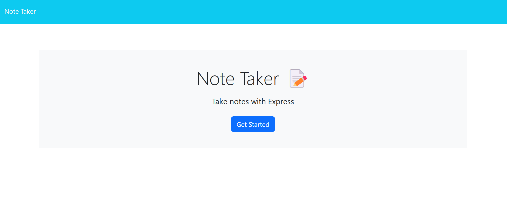

# Note Taker

An application that can be used to write and save notes in order to organize thoughts and keep track of tasts needed to be completed. 

## Usage

When opening the note-taking applicatio the user is presented with a landing page with a link to a notes page. When the user clicks on the link to the notes page they are presented with a page with existing notes listed in the left-hand column. When they enter a new note title and the note's text  a save icon appears and when clicked on the new note is saved and appears on the left hand column. When the user clicks on an existing note in the list in the left-hand column the note appears in the right hand column. When the user clicks on the write icon in the navigation they are presented with empty fields to enter a new note title and the note's text. 

## Screenshots

## Links
(https://parkercf.github.io/Note-Taker)
(https://note-taker-proj.herokuapp.com/)

## Features

- Uses JavaScript
- Uses node.js
- Uses Express.js back end 
- Saves notes to JSON file

## License

[MIT](https://choosealicense.com/licenses/mit/)

